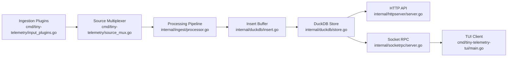

# Tiny Telemetry Layered Design Docs

These docs describe Tiny Telemetry as four decoupled layers:

1. Ingestion plugins
2. Processing pipeline
3. Storage
4. Read surfaces

They are written with a simplicity-first rule:

- Clear boundaries
- Small interfaces
- Swappable implementations
- No framework-heavy abstractions

## Status

- Implemented architecture: documented under each file's `Current Design` section.
- Implemented boundary upgrades: documented under `Implemented Boundary Upgrade`.
- Future ideas only: documented under `Optional Later`.

## Runtime Flow

## Files

- [Ingestion Plugins](./ingestion-plugins.md)
- [Processing Pipeline](./processing-pipeline.md)
- [Storage](./storage.md)
- [Read Surface](./read-surface.md)
- [Interface Contracts](./interfaces.md)

## Operations

- [Durable Local Forwarding With rsyslog](../operations/rsyslog-forwarder.md)
- [DuckDB Backup Strategy](../operations/duckdb-backups.md)

## Decision Rule

For architecture changes, apply this filter:

1. Does this make a layer easier to swap?
2. Does this reduce coupling at a boundary?
3. Is it implementable with a tiny interface and direct wiring?

If any answer is no, defer it.
