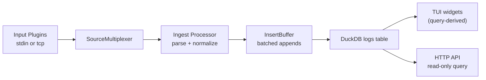

# Lotus Design (Thin DuckDB Core)

## What It Does
Lotus is a long-running logs process with two read surfaces:
- TUI for human real-time inspection
- HTTP API for AI/tool queries

It ingests logs, appends them to DuckDB, and derives all analytics/state from DuckDB queries.

## Business Use Cases
1. Incident response
- Real-time severity trends, top services/hosts, and drill-down in terminal.

2. AI-assisted operations
- Read-only SQL/API access so AI tools can inspect live/retained logs safely.

3. Multi-app visibility
- App-scoped views in the same DB without separate pipelines.

## Core Principles
- DuckDB is the single source of truth.
- Ingestion is append-only into `logs`.
- API/TUI are read models over DB primitives.
- Runtime is imperative and minimal.
- Input is plugin-based, output is fixed (DB + TUI + API).
- Ingest primitives are UI-agnostic; adaptation happens at boundaries only.

## Runtime Architecture

## How It Works
1. Boot
- `cmd/lotus/main.go` loads config and starts one process (`runApp`).

2. Input
- `cmd/lotus/input_plugins.go` selects source plugins.
- `cmd/lotus/source_mux.go` merges enabled sources into one stream.

3. Ingestion
- `internal/ingest/processor.go` parses lines and emits `LogRecord`.
- `internal/ingest/types.go` defines ingest-owned `LogEntry` (no TUI dependency).
- `internal/duckdb/insert.go` buffers and batch-inserts into `logs` only.

4. Read models
- `internal/duckdb/queries*.go` defines reusable query primitives.
- `internal/tui/*` renders panels from query primitives with dynamic panel layout primitives.
- `internal/httpserver/server.go` exposes read-only API (`/api/health`, `/api/schema`, `/api/query`).

## Data Model
- Primary table: `logs`
- Metrics/Prometheus tables removed.
- Word/attribute aggregate tables removed.
- Analytics are computed from `logs` at query time.

## Simplifications Completed
1. Removed command/subcommand framework; single minimal process entrypoint.
2. Removed Prometheus metrics ingestion/query paths.
3. Removed aggregate-table write logic (`word_counts`, `attribute_counts`).
4. Removed in-TUI lifetime aggregation fallback path; stats derive from DuckDB.
5. Kept sidebar visible by default with explicit empty-state.
6. Added app-scoped attribute primitive (`TopAttributesByApp`).
7. Input plugin composition now supports multiple enabled sources at once.
8. Replaced fixed 2x2 panel assumptions with dynamic panel primitives (`SetPanels`, dynamic hit-testing/layout).
9. Added `WITH` query support for read-only API queries.
10. Added runtime file logging (`~/.config/lotus/lotus.log`) instead of discarding process logs.

## Risk/Weakness Review
1. Query cost growth
- On very large datasets, on-the-fly derived analytics can become slower.

2. Schema evolution
- Existing old DBs may still contain legacy tables; they are ignored but not auto-pruned.

3. Mixed concerns in TUI package
- TUI still owns some interactive computation (pattern extraction for modal views).

## Recommendations
1. Keep ingestion append-only and immutable.
2. Add retention/partition strategy (time-window pruning or file rotation policy) for long-running installs.
3. Add query contract tests per TUI panel so each panel is pinned to DB primitives.
4. If needed later, add optional materialized views in DuckDB (still DB-owned, not app-owned state).

## Current Status
- `go test ./...` passes.
- Architecture now matches: thin layer around DuckDB with composable query primitives, read-only API for AI, and TUI for operational visibility.
